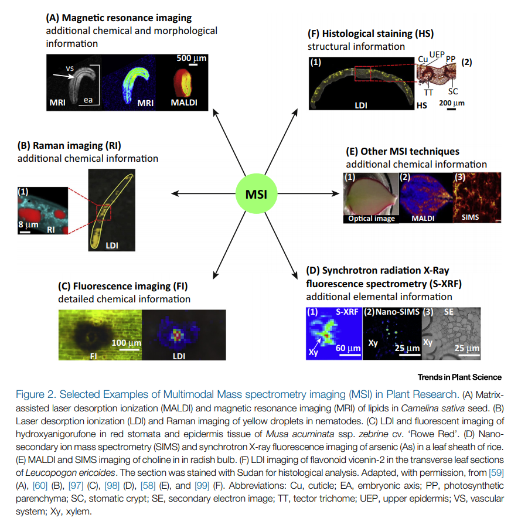

# Mass Spectrometry Imaging

---

## Table of Contents

1.  Why use Mass Spectrometry Imaging?
2.  Mass Spectrometry Imaging Techniques
3.  Mass Spectrometry Imaging Workflows
4.  Mass Spectrometry Imaging Platforms
5.  Machine Learning in Mass Spectrometry Imagining
6.  Mass Spectrometry Imaging Fusions
7.  Resources
8.  References

---

## Mass Spectrometry Imaging Techniques

---

## Mass Spectrometry Imaging Fusions

### Concepts behind Image Fusions

---

## Resources

\* _Resource is dated - may not be maintained._

1.  [MS Imaging](https://ms-imaging.org/wp/) - Home of Mass Spectrometry Imaging
2.  [OMICS Tools](omicstools.com)

### Open Source Libraries

| Name                                                                              | Language | Category | Year | Functionalities | Instrumentation | Comments |
| :-------------------------------------------------------------------------------- | :------- | :------- | :--- | :-------------- | :-------------- | :------- |
| [SpectralAnalysis](https://github.com/AlanRace/SpectralAnalysis)                  | MATLAB   |
| [BASIS](https://bitbucket.org/iAnalytica/basis_pyproc/src/master/)                | Python   |
| [Cardinal](https://github.com/kuwisdelu/Cardinal)                                 | R        |
| [EXIMS](https://sourceforge.net/projects/exims/files/)                            |          |
| [OpenMIMS](https://github.com/BWHCNI/OpenMIMS)                                    | Java     |
| [OOMAT](https://github.com/biorack/omaat)                                         | Python   |
| [PyImagingMSpec](https://github.com/alexandrovteam/pyImagingMSpec)                | Python   |
| [pyimzML](https://github.com/alexandrovteam/pyimzML)                              | Python   |
| [MSImageView](https://github.com/stoeckli/MSImageViewer) \*                       |
| [PySM](https://github.com/alexandrovteam/pySM)                                    | Python   |
| [pyQms](https://github.com/pyQms/pyqms)                                           | Python   |
| [massPix](https://github.com/hallz/massPix)                                       | R        |
| [imzML Validator](https://gitlab.com/imzML/imzMLValidator)                        | Java     |
| [Metaspace](https://github.com/metaspace2020/metaspace)                           | Python   |
| [ChemDistiller](https://bitbucket.org/iAnalytica/chemdistillerpython/src/master/) | Python   |

### Open Sofware

| Name                                                        | OS      | Category | Year | Functionalities | Instrumentation | Comments |
| :---------------------------------------------------------- | :------ | :------- | :--- | :-------------- | :-------------- | :------- |
| [OpenMSI](https://openmsi.nersc.gov/openmsi/client/)        | Webtool |
| [Molecular Image Fusion](http://fusion.vueinnovations.com/) |         |

### Licenced Software

| Name                                          | OS         | Year | Functionalities | Instrumentation | Language | Comments |
| :-------------------------------------------- | :--------- | :--- | :-------------- | :-------------- | :------- | :------- |
| [MassImager]()                                |
| [FlexImaging]()                               |
| [SCiLS Lab]()                                 |
| [msIQuant](https://ms-imaging.org/wp/paquan/) | Windows 7+ |

---

## References

### Reviews

Aichler, Michaela, and Axel Walch. "**MALDI Imaging mass spectrometry: current frontiers and perspectives in pathology research and practice.**" Laboratory investigation 95.4 (2015): 422. [[pdf]](./docs/pdfs/Aichler_et_al-2015-Laboratory_Investigation.pdf)

Nilsson, Anna, et al. "**Mass spectrometry imaging in drug development.**" Analytical chemistry 87.3 (2015): 1437-1455. [[pdf]](./docs/pdfs/nilsson2015.pdf)

Goodwin, R. J. A., J. Bunch, and D. F. McGinnity. "**Mass spectrometry imaging in oncology drug discovery.**" Advances in cancer research. Vol. 134. Academic Press, 2017. 133-171. [[pdf]](./docs/pdfs/goodwin2017.pdf)

Schulz, Sandra, et al. "**Advanced MALDI mass spectrometry imaging in pharmaceutical research and drug development.**" Current opinion in biotechnology 55 (2019): 51-59. [[pdf]](./docs/pdfs/1-s2.0-S095816691830096X-main.pdf)

Caprioli, Richard M. "**Imaging mass spectrometry: Molecular microscopy for the new age of biology and medicine.**" Proteomics 16.11-12 (2016): 1607-1612. [[pdf]](./docs/pdfs/Caprioli-1607-PROTEOMICS.pdf)

Crecelius, A. C., U. S. Schubert, and F. von Eggeling. "**MALDI mass spectrometric imaging meets “omics”: recent advances in the fruitful marriage.**" Analyst 140.17 (2015): 5806-5820. [[pdf]](./docs/pdfs/c5an00990a.pdf)

Nilsson, Anna, et al. "**Mass spectrometry imaging in drug development.**" Analytical chemistry 87.3 (2015): 1437-1455. [[pdf]](./docs/pdfs/nilsson2015.pdf)

Petras, Daniel, Alan K. Jarmusch, and Pieter C. Dorrestein. "**From single cells to our planet—recent advances in using mass spectrometry for spatially resolved metabolomics.**" Current opinion in chemical biology 36 (2017): 24-31. [[pdf]](./docs/pdfs/petras2017.pdf)

Boughton, Berin A., et al. "**Mass spectrometry imaging for plant biology: a review.**" Phytochemistry Reviews 15.3 (2016): 445-488. [[pdf]](./docs/pdfs/10.1007%2Fs11101-015-9440-2.pdf)

Dong, Yonghui, Bin Li, and Asaph Aharoni. "**More than pictures: when MS imaging meets histology.**" Trends in plant science 21.8 (2016): 686-698. [[pdf]](./docs/pdfs/dong2016.pdf)

Siegel, Tiffany Porta, et al. "**Mass Spectrometry Imaging and Integration with Other Imaging Modalities for Greater Molecular Understanding of Biological Tissues.**" Molecular Imaging and Biology (2018): 1-14. [[pdf]](./docs/pdfs/PortaSiegel2018.pdf)

Ho, Ying‐Ning, Lin‐Jie Shu, and Yu‐Liang Yang. "**Imaging mass spectrometry for metabolites: technical progress, multimodal imaging, and biological interactions.**" Wiley Interdisciplinary Reviews: Systems Biology and Medicine 9.5 (2017): e1387. [[pdf]](./docs/pdfs/WIRESSBM_17_e1387.pdf)

Buchberger, Amanda Rae, et al. "**Mass spectrometry imaging: a review of emerging advancements and future insights.**" Analytical chemistry 90.1 (2017): 240-265. [[pdf]](./docs/pdfs/buchberger2017.pdf)

Bishop, David P., et al. "**A guide to integrating immunohistochemistry and chemical imaging.**" Chemical Society Reviews 47.11 (2018): 3770-3787. [[pdf]](./docs/pdfs/c7cs00610a.pdf)

Prideaux, Brendan, Anne Lenaerts, and Véronique Dartois. "**Imaging and spatially resolved quantification of drug distribution in tissues by mass spectrometry.**" Current opinion in chemical biology 44 (2018): 93-100. [[pdf]](./docs/pdfs/1-s2.0-S1367593117302211-main.pdf)

### Quantitative Techniques

Behrmann, Jens, et al. "**Deep learning for tumor classification in imaging mass spectrometry.**" Bioinformatics 1 (2017): 9. [[pdf]](./docs/pdfs/1705.01015.pdf)

Zhang, Ye, and Xin Liu. "**Machine learning techniques for mass spectrometry imaging data analysis and applications.**" (2018): 519-522. [[pdf]](./docs/pdfs/bio-2017-0281.pdf)

Galli, Manuel, et al. "**Machine learning approaches in MALDI-MSI: clinical applications.**" Expert review of proteomics 13.7 (2016): 685-696. [[pdf]](./docs/pdfs/galli2016.pdf)

Pleska, Arijus. "**Spatial Smoothing in Mass Spectrometry Imaging.**" (2017). [[pdf]](./docs/pdfs/03557e77ab877bec1622bdf16b54f152f841.pdf)

Jones, Emrys A., et al. "**Imaging mass spectrometry statistical analysis.**" Journal of proteomics 75.16 (2012): 4962-4989. [[pdf]](./docs/pdfs/jones2012.pdf)

Alexandrov, Theodore. "**MALDI imaging mass spectrometry: statistical data analysis and current computational challenges.**" BMC bioinformatics 13.16 (2012): S11. [[pdf]](./docs/pdfs/1471-2105-13-S16-S11.pdf)

Trede, Dennis, et al. "**On the importance of mathematical methods for analysis of MALDI-imaging mass spectrometry data.**" Journal of Integrative Bioinformatics (JIB) 9.1 (2012): 1-11. [[pdf]](./docs/pdfs/dennistrede2012.pdf)

Dexter, Alex, et al. "**Two-phase and graph-based clustering methods for accurate and efficient segmentation of large mass spectrometry images.**" Analytical chemistry 89.21 (2017): 11293-11300. [[pdf]](./docs/pdfs/dexter2017.pdf)

Abdelmoula, Walid M., et al. "**Interactive visual exploration of 3D mass spectrometry imaging data using hierarchical stochastic neighbor embedding reveals spatiomolecular structures at full data resolution.**" Journal of proteome research 17.3 (2018): 1054-1064. [[pdf]](./docs/pdfs/abdelmoula2018.pdf)

Abdelmoula, Walid M., et al. "**Automatic generic registration of mass spectrometry imaging data to histology using nonlinear stochastic embedding.**" Analytical chemistry 86.18 (2014): 9204-9211. [[pdf]](./docs/pdfs/abdelmoula2014.pdf)

Thomas, Spencer A., et al. "**Dimensionality reduction of mass spectrometry imaging data using autoencoders.**" Computational Intelligence (SSCI), 2016 IEEE Symposium Series on. IEEE, 2016. [[pdf]](./docs/pdfs/thomas2016.pdf)

Thomas, Spencer A., et al. "**Enhancing classification of mass spectrometry imaging data with deep neural networks.**" Computational Intelligence (SSCI), 2017 IEEE Symposium Series on. IEEE, 2017. [[pdf]](./docs/pdfs/thomas2017.pdf)

### Software Tools

Ràfols, Pere, et al. "**Signal preprocessing, multivariate analysis and software tools for MA (LDI)‐TOF mass spectrometry imaging for biological applications.**" Mass spectrometry reviews 37.3 (2018): 281-306. [[pdf]](./docs/pdfs/rfols2016.pdf)

Race, Alan M., et al. "**SpectralAnalysis: software for the masses.**" Analytical chemistry 88.19 (2016): 9451-9458. [[pdf]](./docs/pdfs/race2016.pdf)

Palmer, Andrew, et al. "**FDR-controlled metabolite annotation for high-resolution imaging mass spectrometry.**" Nature methods 14.1 (2017): 57. [[pdf]](./docs/pdfs/palmer2016.pdf)

Leufken, Johannes, et al. "**pyQms enables universal and accurate quantification of mass spectrometry data.**" Molecular & Cellular Proteomics (2017): mcp-M117. [[pdf]](./docs/pdfs/mcp.M117.068007.full.pdf)

> Not IMS specific

Bemis, Kyle D., et al. "**Cardinal: an R package for statistical analysis of mass spectrometry-based imaging experiments.**" Bioinformatics 31.14 (2015): 2418-2420. [[pdf]](./docs/pdfs/cardinal.pdf)

Laponogov, Ivan, et al. "**ChemDistiller: an engine for metabolite annotation in mass spectrometry.**" Bioinformatics 34.12 (2018): 2096-2102. [[pdf]](./docs/pdfs/bty080.pdf)

> Not IMS specific

Bond, Nicholas J., et al. "**massPix: an R package for annotation and interpretation of mass spectrometry imaging data for lipidomics.**" Metabolomics 13.11 (2017): 128. [[pdf]](./docs/pdfs/Bond2017.pdf)

Race, Alan Mark, and Andreas Römpp. "**Error-free data visualisation and processing through imzML and mzML validation.**" Analytical chemistry (2018). [[pdfs]](./docs/pdfs/10.1021@acs.analchem.8b03059.pdf)

C. Silva, Ana S., et al. "**Data-driven rescoring of metabolite annotations significantly improves sensitivity.**" Analytical chemistry (2018). [[pdf]](./docs/pdfs/10.1021@acs.analchem.8b03224.pdf)

Veselkov, Kirill, et al. "**BASIS: High-performance bioinformatics platform for processing of large-scale mass spectrometry imaging data in chemically augmented histology.**" Scientific reports 8.1 (2018): 4053. [[pdf]](./docs/pdfs/s41598-018-22499-z.pdf)

Wijetunge, Chalini D., et al. "**EXIMS: an improved data analysis pipeline based on a new peak picking method for EXploring Imaging Mass Spectrometry data.**" Bioinformatics 31.19 (2015): 3198-3206. [[pdf]](./docs/pdfs/btv356.pdf)

Poczatek, Collin, Zeke Kaufman, and Claude Lechene. "**OpenMIMS ImageJ Plugin Guide.**" Harvard Medical School (Boston, Massachusetts, USA) (2009). [[pdf]](./docs/pdfs/openmims-manual.pdf)

He, Jiuming, et al. "**MassImager: A software for interactive and in-depth analysis of mass spectrometry imaging data.**" Analytica chimica acta 1015 (2018): 50-57. [[pdf]](./docs/pdfs/he2018.pdf)

Bokhart, Mark T., et al. "**MSiReader v1. 0: evolving open-source mass spectrometry imaging software for targeted and untargeted analyses.**" Journal of The American Society for Mass Spectrometry 29.1 (2018): 8-16. [[pdf]](./docs/pdfs/bokhart2017.pdf)

Källback, Patrik, et al. "**A Space Efficient Direct Access Data Compression Approach for Mass Spectrometry Imaging.**" Analytical chemistry 90.6 (2018): 3676-3682. [[pdf]](./docs/pdfs/kllback2018.pdf)

### Key Papers

Van de Plas, Raf, et al. "**Image fusion of mass spectrometry and microscopy: a multimodality paradigm for molecular tissue mapping.**" Nature methods 12.4 (2015): 366. [[pdf]](./docs/pdfs/vanderplas.pdf) [[supplemental]](./docs/pdfs/nmeth.3296-S1.pdf)

Passarelli, Melissa K., et al. "**Single-cell analysis: visualizing pharmaceutical and metabolite uptake in cells with label-free 3D mass spectrometry imaging.**" Analytical chemistry 87.13 (2015): 6696-6702. [[pdf]](./docs/pdfs/Passarelli_author-accepted-manuscript.pdf)

Davidson, Shawn M., et al. "**Direct evidence for cancer-cell-autonomous extracellular protein catabolism in pancreatic tumors.**" Nature medicine 23.2 (2017): 235. [[pdf]](./docs/pdfs/nm.4256.pdf) [[supplemental]](./docs/pdfs/nm.4256-S1.pdf)

Römpp, Andreas, and Bernhard Spengler. "**Mass spectrometry imaging with high resolution in mass and space.**" Histochemistry and cell biology 139.6 (2013): 759-783. [[pdf]](./docs/pdfs/rmpp2013.pdf)

Norris, Jeremy L., and Richard M. Caprioli. "**Analysis of tissue specimens by matrix-assisted laser desorption/ionization imaging mass spectrometry in biological and clinical research.**" Chemical reviews 113.4 (2013): 2309-2342. [[pdf]](./docs/pdfs/norris2013.pdf)

Cassat, James E., et al. "**Integrated molecular imaging reveals tissue heterogeneity driving host-pathogen interactions.**" Science translational medicine 10.432 (2018): eaan6361. [[pdf]](./docs/pdfs/cassat2018.pdf)

Verbeeck, Nico, et al. "**Automated anatomical interpretation of ion distributions in tissue: linking imaging mass spectrometry to curated atlases.**" Analytical chemistry 86.18 (2014): 8974-8982. [[pdf]](.docs/pdfs/verbeeck2014.pdf)

Abdelmoula, Walid M., et al. "**Automatic registration of mass spectrometry imaging data sets to the Allen brain atlas.**" Analytical chemistry 86.8 (2014): 3947-3954. [[pdf]](./docs/pdfs/Automatic_Registration_of_Mass_Spectrome.pdf)

Verbeeck, Nico, et al. "**Connecting imaging mass spectrometry and magnetic resonance imaging-based anatomical atlases for automated anatomical interpretation and differential analysis.**" Biochimica et Biophysica Acta (BBA)-Proteins and Proteomics 1865.7 (2017): 967-977. [[pdf]](./docs/pdfs/verbeeck2017.pdf)

### Dissertations

Palmer, Andrew D. **Information processing for mass spectrometry imaging.** Diss. University of Birmingham, 2014. [[pdf]](./docs/pdfs/Palmer14PhD.pdf)

Race, Alan M. **Investigation and interpretation of large mass spectrometry imaging datasets.** Diss. University of Birmingham, 2016. [[pdf]](./docs/pdfs/Race16PhD.pdf)

Abdelmoula, Walid Mohamed. **Data analysis for mass spectrometry imaging: methods and applications**. Diss. 2017. [[link]](https://openaccess.leidenuniv.nl/handle/1887/45501)
